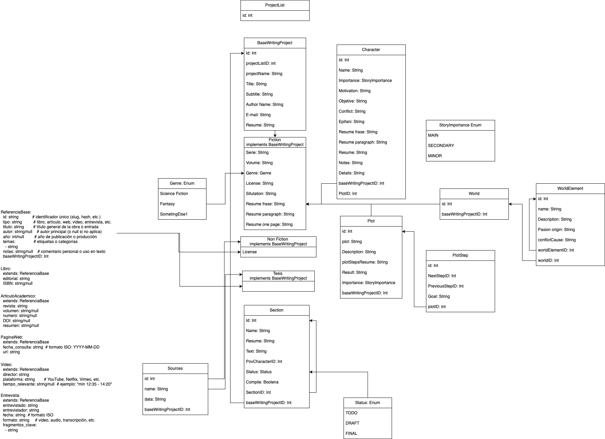

# Welcome to your Lovable project

## Project info

**URL**: https://lovable.dev/projects/130b1ba2-93d1-4c94-a455-269e9c7ca3b5

**Use your preferred IDE**

If you want to work locally using your own IDE, you can clone this repo and push changes. Pushed changes will also be reflected in Lovable.

Follow these steps:
we use fnm (as system control version manager for Node.js) https://github.com/Schniz/fnm

Install

```sh
# Step 1: Install fnm (Fast Node Manager) to manage Node.js versions.
brew install fnm
# Step 2: install and use the node js version with this
fnm use

# Step 3: Install the necessary dependencies.
npm i

# Step 4: Start the development server with auto-reloading and an instant preview.
npm run dev
```

**Edit a file directly in GitHub**

- Navigate to the desired file(s).
- Click the "Edit" button (pencil icon) at the top right of the file view.
- Make your changes and commit the changes.

**Use GitHub Codespaces**

- Navigate to the main page of your repository.
- Click on the "Code" button (green button) near the top right.
- Select the "Codespaces" tab.
- Click on "New codespace" to launch a new Codespace environment.
- Edit files directly within the Codespace and commit and push your changes once you're done.

## What technologies are used for this project?

This project is built with:

- Vite
- TypeScript
- React
- shadcn-ui
- Tailwind CSS

## Naming conventions for PRs

| Type       | When to use?                                                 |
| ---------- | ------------------------------------------------------------ |
| `feat`     | New functionality                                            |
| `fix`      | Bug fixes                                                    |
| `refactor` | Change internal structure without change functionality       |
| `chore`    | Minor changes: updates, scripts, lint, configs               |
| `docs`     | Documentation changes                                        |
| `style`    | Format changes, spaces, commas, without impact functionality |
| `test`     | Add or improve tests                                         |
| `perf`     | Improve performance                                          |
| `build`    | Build changes, dependencies, CI/CD                           |

## Current Models And Relations Diagram



## How can I deploy this project?

Simply open [Lovable](https://lovable.dev/projects/130b1ba2-93d1-4c94-a455-269e9c7ca3b5) and click on Share -> Publish.

## Backend setup:

To setup and run backend you need to follow these steps:

1 - run on terminal:

```
cd backend && python3 -m venv .venv && source .venv/bin/activate && pip3 install -r requirements.txt
```

2 - you can run: `npm run dev-backend`

3 - Backend will be running on: http://localhost:8000

## Can I connect a custom domain to my Lovable project?

Yes, you can!

To connect a domain, navigate to Project > Settings > Domains and click Connect Domain.

Read more here: [Setting up a custom domain](https://docs.lovable.dev/tips-tricks/custom-domain#step-by-step-guide)
